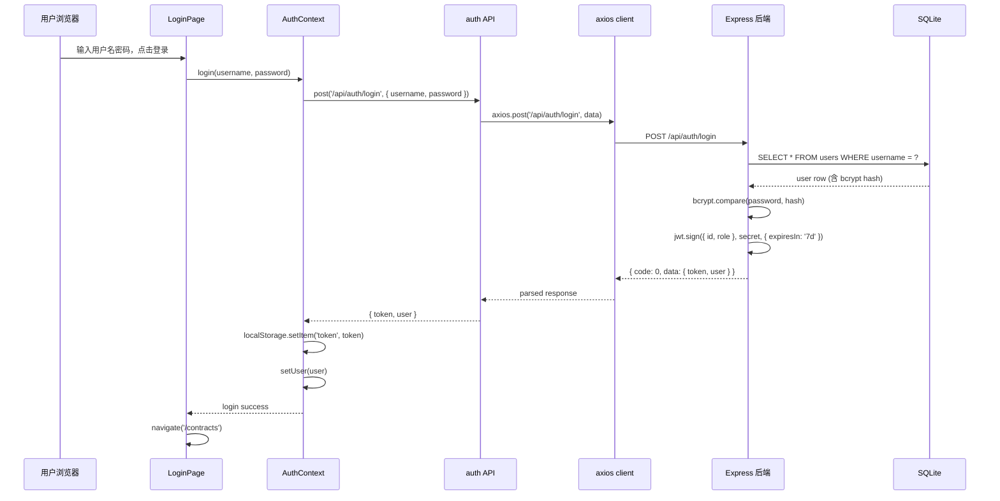
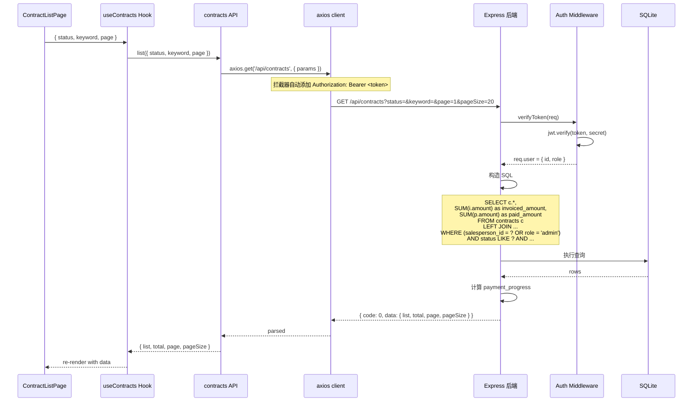
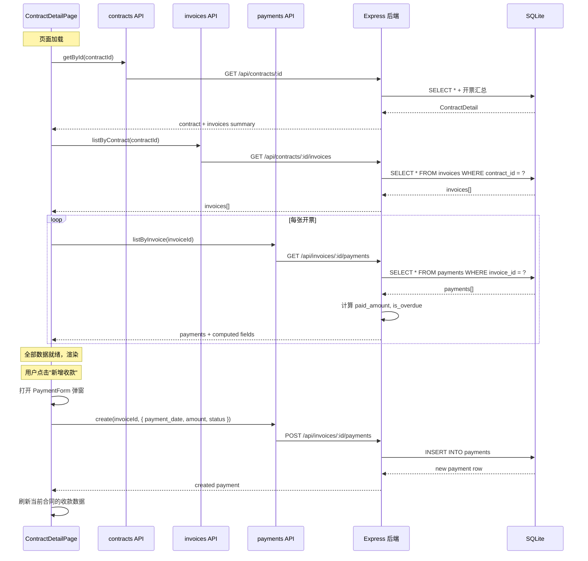
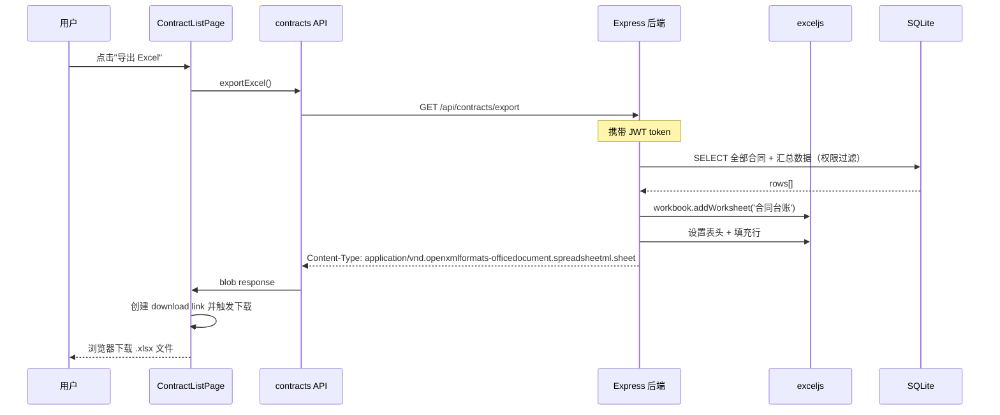
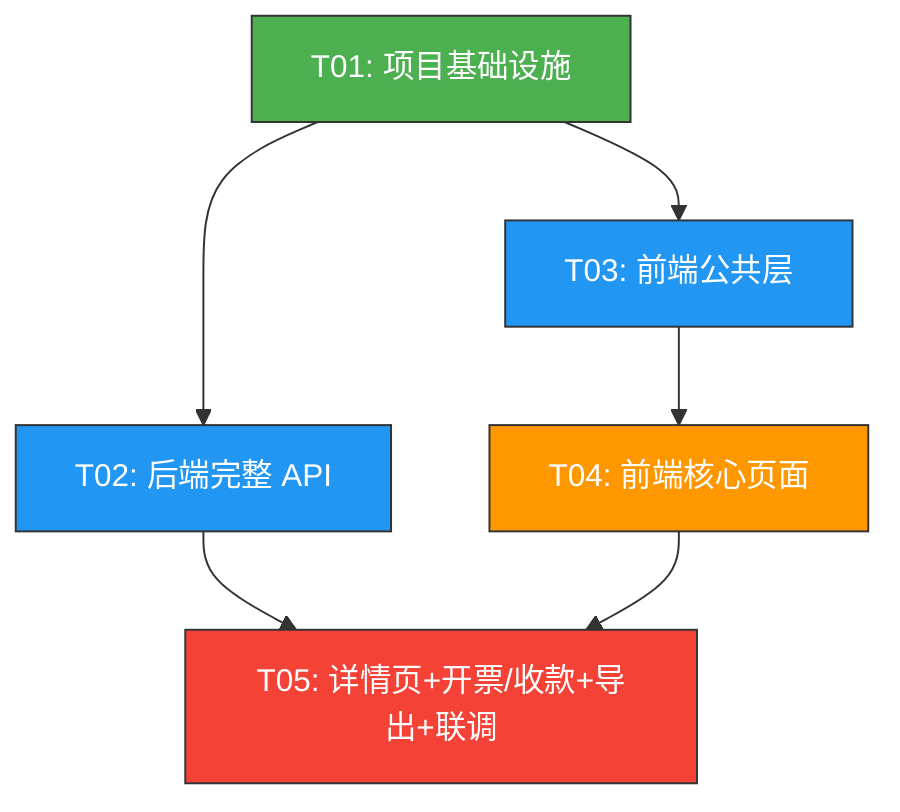

# 合同执行情况跟踪共享平台 — 系统架构设计 + 任务分解

> **角色**：Bob（架构师）  
> **日期**：2025-07-17  
> **项目根目录**：`D:\ShareHub\contract-tracker\`

---

## Part A：系统设计

---

### 1. 实现方案

#### 1.1 核心技术难点分析

| 难点 | 说明 | 解决方案 |
|------|------|----------|
| 三层数据关联 | 合同 → 开票 → 收款，三级嵌套 CRUD，前端状态管理复杂 | Express 嵌套路由 + React 组件化分治 |
| 数据权限隔离 | 业务员只能看自己的合同，管理员看全部 | JWT 中间件统一鉴权 + SQL WHERE salesperson_id 过滤 |
| 外网 NAT 穿透 | 公司内网服务需通过外网域名访问 | 后端无状态 API，花生壳映射 80/443 端口 |
| Excel 导出 | 合同台账和开票记录需导出为 xlsx | 后端使用 `exceljs` 生成，前端触发下载 |
| 回款逾期判定 | 开票后超期未回款需标记"逾期" | 后端查询时动态计算 overdue 字段，前端展示标签 |

#### 1.2 框架与库选型

**后端（server/）**

| 库 | 版本 | 用途 | 选型理由 |
|----|------|------|----------|
| express | ^4.18 | HTTP 框架 | Node.js 最成熟、生态最广的 Web 框架 |
| better-sqlite3 | ^11.0 | SQLite 数据库 | 零配置、同步 API、性能优异，适合轻量内网部署 |
| jsonwebtoken | ^9.0 | JWT 认证 | stateless 鉴权，无需服务端会话存储 |
| bcryptjs | ^2.4 | 密码哈希 | 纯 JS 实现，无 C++ 编译依赖，部署简单 |
| exceljs | ^4.4 | Excel 导出 | 支持 xlsx 流式写入，内存占用低 |
| cors | ^2.8 | 跨域中间件 | 开发时前后端分离需要，生产可收紧 |
| tsx | ^4.7 | TypeScript 执行 | 开发模式下直接运行 TS，无需编译步骤 |

**前端（client/）**

| 库 | 版本 | 用途 | 选型理由 |
|----|------|------|----------|
| react | ^18.3 | UI 框架 | 组件化、生态丰富、团队熟悉度高 |
| @mui/material | ^5.16 | 组件库 | 开箱即用的 Material Design 组件，表格/表单/对话框齐全 |
| @mui/icons-material | ^5.16 | 图标 | 与 MUI 原生配合 |
| @emotion/react | ^11 | CSS-in-JS 引擎 | MUI 底层依赖 |
| react-router-dom | ^6.26 | 路由 | SPA 路由标配 |
| tailwindcss | ^3.4 | 原子化 CSS | 配合 MUI 微调间距/颜色，减少手写 CSS |
| axios | ^1.7 | HTTP 客户端 | 拦截器机制适合统一处理 JWT 令牌和错误 |
| dayjs | ^1.11 | 日期处理 | 轻量（2KB），用于日期格式化和计算 |
| xlsx | ^0.18 | 前端 Excel 导出（备选） | 如需纯前端导出可用，默认走后端导出 |

#### 1.3 架构模式

```
┌─────────────────────────────────────────────────┐
│                   花生壳 NAT 穿透                    │
│        外网域名 → 内网服务器 IP:端口                  │
└──────────────────────┬──────────────────────────┘
                       │
┌──────────────────────▼──────────────────────────┐
│              Express 后端 (server/)                │
│  ┌─────────┐ ┌──────────┐ ┌──────────────────┐   │
│  │ 中间件层 │→│ 路由层    │→│ 数据库层           │   │
│  │ auth    │  │ auth     │  │ better-sqlite3   │   │
│  │ cors    │  │ contracts│  │                  │   │
│  │ error   │  │ invoices │  │                  │   │
│  │         │  │ payments │  │                  │   │
│  └─────────┘ └──────────┘ └──────────────────┘   │
└──────────────────────┬──────────────────────────┘
                       │ REST API (JSON)
┌──────────────────────▼──────────────────────────┐
│           React SPA 前端 (client/)                 │
│  ┌─────────┐ ┌──────────┐ ┌──────────────────┐   │
│  │ 路由层    │→│ 页面层    │→│ 组件层            │   │
│  │ /login  │  │ Login    │  │ ContractTable    │   │
│  │ /contracts││ List     │  │ InvoiceSection   │   │
│  │ /c/:id  │  │ Detail   │  │ PaymentSection   │   │
│  └─────────┘ └──────────┘ └──────────────────┘   │
│                        ↕                          │
│                    Context / Hooks                 │
│              (AuthContext + API Hooks)              │
└─────────────────────────────────────────────────┘
```

**分层说明**：
- **后端**：经典的三层架构（中间件 → 路由 → 数据库），每个路由文件独立，职责单一
- **前端**：容器/展示组件模式，页面组件负责数据获取和状态管理，UI 组件负责渲染
- **认证**：JWT 无状态令牌，前端存储在 `localStorage`，每次请求通过 axios 拦截器自动携带

---

### 2. 文件列表

#### 2.1 项目根文件

```
contract-tracker/
├── package.json                  # 工作区根配置（可选 workspace）
├── .gitignore
└── README.md
```

#### 2.2 后端文件（server/）

```
server/
├── package.json
├── tsconfig.json
├── .env                          # JWT_SECRET, PORT, ADMIN_PASSWORD 等
├── src/
│   ├── index.ts                  # 服务入口：启动服务器
│   ├── app.ts                    # Express 应用配置：中间件 + 路由注册
│   ├── database.ts               # 数据库初始化 + 建表语句 + seed
│   ├── middleware/
│   │   ├── auth.ts               # JWT 验证中间件
│   │   └── errorHandler.ts       # 全局错误处理中间件
│   ├── routes/
│   │   ├── auth.ts               # POST /api/auth/login, GET /api/auth/me
│   │   ├── contracts.ts          # /api/contracts CRUD
│   │   ├── invoices.ts           # /api/contracts/:id/invoices CRUD
│   │   └── payments.ts           # /api/invoices/:id/payments CRUD
│   └── utils/
│       └── export.ts             # Excel 导出逻辑
```

#### 2.3 前端文件（client/）

```
client/
├── index.html
├── package.json
├── vite.config.ts
├── tsconfig.json
├── tsconfig.node.json
├── tailwind.config.js
├── postcss.config.js
├── src/
│   ├── main.tsx                  # React 入口
│   ├── App.tsx                   # 根组件：路由定义
│   ├── index.css                 # Tailwind 指令 + 全局样式
│   ├── vite-env.d.ts             # Vite 类型声明
│   ├── types/
│   │   └── index.ts              # 所有 TypeScript 类型定义
│   ├── api/
│   │   ├── client.ts             # axios 实例 + 拦截器
│   │   ├── auth.ts               # 登录/登出/获取用户 API
│   │   ├── contracts.ts          # 合同 CRUD API
│   │   ├── invoices.ts           # 开票记录 CRUD API
│   │   └── payments.ts           # 收款记录 CRUD API
│   ├── context/
│   │   └── AuthContext.tsx        # 认证上下文（用户状态 + 登录/登出方法）
│   ├── hooks/
│   │   ├── useAuth.ts            # 使用 AuthContext 的快捷 Hook
│   │   ├── useContracts.ts       # 合同列表数据获取 Hook
│   │   └── useInvoices.ts        # 开票记录 + 收款跟踪 Hook
│   ├── components/
│   │   ├── Layout.tsx            # 全局布局：AppBar + 侧边导航 + 内容区
│   │   ├── ProtectedRoute.tsx    # 路由守卫（未登录重定向到 /login）
│   │   ├── ContractTable.tsx     # 合同表格组件
│   │   ├── ContractFilter.tsx    # 筛选面板（状态下拉/搜索/日期范围）
│   │   ├── ContractForm.tsx      # 合同新增/编辑表单
│   │   ├── InvoiceSection.tsx    # 开票记录区块（子表格 + 操作按钮）
│   │   ├── InvoiceForm.tsx       # 开票记录新增/编辑弹窗
│   │   ├── PaymentSection.tsx    # 收款跟踪区块（子表格 + 操作按钮）
│   │   ├── PaymentForm.tsx       # 收款记录新增/编辑弹窗
│   │   ├── StatusChip.tsx        # 状态标签（合同状态/回款状态/逾期标记）
│   │   ├── ConfirmDialog.tsx     # 通用确认对话框（用于删除确认）
│   │   └── LoadingOverlay.tsx    # 加载遮罩
│   └── pages/
│       ├── LoginPage.tsx         # 登录页
│       ├── ContractListPage.tsx  # 合同列表页
│       ├── ContractFormPage.tsx  # 合同新增/编辑页
│       └── ContractDetailPage.tsx# 合同详情页（含开票、收款）
```

---

### 3. 数据结构与接口

#### 3.1 数据库表设计

```sql
-- 用户表
CREATE TABLE users (
  id          INTEGER PRIMARY KEY AUTOINCREMENT,
  username    TEXT    NOT NULL UNIQUE,
  password    TEXT    NOT NULL,           -- bcrypt 哈希
  display_name TEXT   NOT NULL,
  role        TEXT    NOT NULL DEFAULT 'sales' CHECK(role IN ('sales', 'admin')),
  created_at  TEXT    NOT NULL DEFAULT (datetime('now'))
);

-- 合同表
CREATE TABLE contracts (
  id             INTEGER PRIMARY KEY AUTOINCREMENT,
  contract_no    TEXT    NOT NULL UNIQUE,   -- 合同编号
  contract_name  TEXT    NOT NULL,           -- 合同名称
  party          TEXT    NOT NULL,           -- 签约方
  amount         REAL    NOT NULL,           -- 合同金额
  signed_date    TEXT    NOT NULL,           -- 签约日期 (YYYY-MM-DD)
  status         TEXT    NOT NULL DEFAULT '进行中' CHECK(status IN ('进行中', '已完成', '已终止')),
  salesperson_id INTEGER NOT NULL,           -- 业务员用户ID
  created_at     TEXT    NOT NULL DEFAULT (datetime('now')),
  updated_at     TEXT    NOT NULL DEFAULT (datetime('now')),
  FOREIGN KEY (salesperson_id) REFERENCES users(id)
);

-- 开票记录表
CREATE TABLE invoices (
  id            INTEGER PRIMARY KEY AUTOINCREMENT,
  contract_id   INTEGER NOT NULL,
  invoice_no    TEXT    NOT NULL,            -- 发票号
  invoice_date  TEXT    NOT NULL,            -- 开票日期 (YYYY-MM-DD)
  amount        REAL    NOT NULL,            -- 开票金额
  invoice_type  TEXT    NOT NULL DEFAULT '增值税专用发票', -- 发票类型
  created_at    TEXT    NOT NULL DEFAULT (datetime('now')),
  updated_at    TEXT    NOT NULL DEFAULT (datetime('now')),
  FOREIGN KEY (contract_id) REFERENCES contracts(id) ON DELETE CASCADE
);

-- 收款记录表
CREATE TABLE payments (
  id           INTEGER PRIMARY KEY AUTOINCREMENT,
  invoice_id   INTEGER NOT NULL,
  payment_date TEXT    NOT NULL,             -- 收款日期 (YYYY-MM-DD)
  amount       REAL    NOT NULL,             -- 收款金额
  status       TEXT    NOT NULL DEFAULT '未回款' CHECK(status IN ('未回款', '部分回款', '已回款')),
  created_at   TEXT    NOT NULL DEFAULT (datetime('now')),
  updated_at   TEXT    NOT NULL DEFAULT (datetime('now')),
  FOREIGN KEY (invoice_id) REFERENCES invoices(id) ON DELETE CASCADE
);
```

#### 3.2 API 接口定义

**认证**

| 方法 | 路径 | 说明 | 鉴权 |
|------|------|------|------|
| POST | `/api/auth/login` | 登录，返回 JWT | 否 |
| GET | `/api/auth/me` | 获取当前用户信息 | 是 |

**合同**

| 方法 | 路径 | 说明 | 鉴权 |
|------|------|------|------|
| GET | `/api/contracts` | 获取合同列表（支持筛选/搜索/分页） | 是 |
| POST | `/api/contracts` | 新增合同 | 是 |
| GET | `/api/contracts/:id` | 获取合同详情（含汇总统计） | 是 |
| PUT | `/api/contracts/:id` | 修改合同 | 是 |
| DELETE | `/api/contracts/:id` | 删除合同 | 是 |
| GET | `/api/contracts/export` | 导出合同台账 Excel | 是 |

**开票记录**

| 方法 | 路径 | 说明 | 鉴权 |
|------|------|------|------|
| GET | `/api/contracts/:id/invoices` | 获取某合同下的所有开票记录 | 是 |
| POST | `/api/contracts/:id/invoices` | 新增开票记录 | 是 |
| PUT | `/api/invoices/:id` | 修改开票记录 | 是 |
| DELETE | `/api/invoices/:id` | 删除开票记录 | 是 |

**收款记录**

| 方法 | 路径 | 说明 | 鉴权 |
|------|------|------|------|
| GET | `/api/invoices/:id/payments` | 获取某开票下的所有收款记录 | 是 |
| POST | `/api/invoices/:id/payments` | 新增收款记录 | 是 |
| PUT | `/api/payments/:id` | 修改收款记录 | 是 |
| DELETE | `/api/payments/:id` | 删除收款记录 | 是 |

**请求/响应格式**

```typescript
// 成功响应
{
  "code": 0,
  "data": { ... },
  "message": "ok"
}

// 分页响应
{
  "code": 0,
  "data": {
    "list": [...],
    "total": 100,
    "page": 1,
    "pageSize": 20
  },
  "message": "ok"
}

// 错误响应
{
  "code": 40101,
  "data": null,
  "message": "登录凭证已过期，请重新登录"
}
```

**错误码定义**

| 错误码 | 含义 |
|--------|------|
| 0 | 成功 |
| 40000 | 请求参数错误 |
| 40100 | 未登录 |
| 40101 | 令牌过期 |
| 40300 | 无权限 |
| 40400 | 资源不存在 |
| 40900 | 数据冲突（如合同编号重复） |
| 50000 | 服务器内部错误 |

#### 3.3 React 类型定义

```typescript
// ====== 数据模型 ======
interface User {
  id: number;
  username: string;
  display_name: string;
  role: 'sales' | 'admin';
}

interface Contract {
  id: number;
  contract_no: string;
  contract_name: string;
  party: string;
  amount: number;
  signed_date: string;       // YYYY-MM-DD
  status: '进行中' | '已完成' | '已终止';
  salesperson_id: number;
  created_at: string;
  updated_at: string;
}

// 合同列表项（含计算字段）
interface ContractListItem extends Contract {
  invoiced_amount: number;   // 已开票金额
  paid_amount: number;       // 已收款金额
  payment_progress: number;  // 回款进度百分比 0-100
}

// 合同详情（含汇总）
interface ContractDetail extends Contract {
  invoices: InvoiceWithPayments[];
  invoiced_amount: number;
  paid_amount: number;
  payment_progress: number;
}

interface Invoice {
  id: number;
  contract_id: number;
  invoice_no: string;
  invoice_date: string;
  amount: number;
  invoice_type: string;
  created_at: string;
  updated_at: string;
}

interface InvoiceWithPayments extends Invoice {
  payments: Payment[];
  paid_amount: number;       // 已收金额汇总
  is_overdue: boolean;       // 是否逾期（动态计算）
}

interface Payment {
  id: number;
  invoice_id: number;
  payment_date: string;
  amount: number;
  status: '未回款' | '部分回款' | '已回款';
  created_at: string;
  updated_at: string;
}

// ====== API 请求参数 ======
interface LoginRequest {
  username: string;
  password: string;
}

interface ContractQuery {
  page?: number;
  pageSize?: number;
  status?: string;
  keyword?: string;          // 搜索合同编号/名称/签约方
  startDate?: string;
  endDate?: string;
}

interface ContractCreatePayload {
  contract_no: string;
  contract_name: string;
  party: string;
  amount: number;
  signed_date: string;
  status: string;
}

interface InvoiceCreatePayload {
  invoice_no: string;
  invoice_date: string;
  amount: number;
  invoice_type: string;
}

interface PaymentCreatePayload {
  payment_date: string;
  amount: number;
  status: string;
}

// ====== API 响应 ======
interface ApiResponse<T> {
  code: number;
  data: T;
  message: string;
}

interface PaginatedData<T> {
  list: T[];
  total: number;
  page: number;
  pageSize: number;
}
```

#### 3.4 React 组件树

```typescript
// 组件树结构（缩进表示嵌套关系）
<App>
  <BrowserRouter>
    <AuthProvider>
      <Routes>
        <Route path="/login" element={<LoginPage />} />
        
        {/* 受保护路由 */}
        <Route element={<ProtectedRoute />}>
          <Route element={<Layout />}>
            <Route index element={<Navigate to="/contracts" />} />
            <Route path="/contracts" element={<ContractListPage />} />
            <Route path="/contracts/new" element={<ContractFormPage />} />
            <Route path="/contracts/:id/edit" element={<ContractFormPage />} />
            <Route path="/contracts/:id" element={<ContractDetailPage />} />
          </Route>
        </Route>
        
        <Route path="*" element={<Navigate to="/contracts" />} />
      </Routes>
    </AuthProvider>
  </BrowserRouter>
</App>

// ContractListPage 内部树
<ContractListPage>
  <ContractFilter />           // 筛选面板
  <Button>新增合同</Button>
  <ContractTable />            // 表格列表
  <Pagination />
</ContractListPage>

// ContractDetailPage 内部树
<ContractDetailPage>
  // 合同信息卡片
  <Paper>
    <Typography>合同基本信息</Typography>
    <StatusChip />             // 合同状态标签
    // 回款进度条
    <LinearProgress value={payment_progress} />
  </Paper>
  
  // 开票记录区块
  <InvoiceSection>
    <Button>新增开票</Button>
    <Table>
      // 行内操作：编辑 / 删除
    </Table>
    <InvoiceForm />            // 开票弹窗
    <PaymentSection>           // 收款跟踪子表（嵌套在开票行内）
      <Button>新增收款</Button>
      <Table />
      <PaymentForm />          // 收款弹窗
    </PaymentSection>
  </InvoiceSection>
</ContractDetailPage>
```

#### 3.5 类图

```mermaid
classDiagram
    class User {
        +number id
        +string username
        +string password
        +string display_name
        +string role
        +string created_at
        +login(username, password) string
        +toJSON() object
    }

    class Contract {
        +number id
        +string contract_no
        +string contract_name
        +string party
        +number amount
        +string signed_date
        +string status
        +number salesperson_id
        +string created_at
        +string updated_at
        +getInvoices() Invoice[]
        +getPaymentSummary() {invoiced_amount, paid_amount, progress}
    }

    class Invoice {
        +number id
        +number contract_id
        +string invoice_no
        +string invoice_date
        +number amount
        +string invoice_type
        +string created_at
        +string updated_at
        +getPayments() Payment[]
        +getPaidAmount() number
        +isOverdue(days: number) boolean
    }

    class Payment {
        +number id
        +number invoice_id
        +string payment_date
        +number amount
        +string status
        +string created_at
        +string updated_at
    }

    class AuthMiddleware {
        +verifyToken(req, res, next) void
        +requireAdmin(req, res, next) void
    }

    class ErrorHandler {
        +handle(err, req, res, next) void
    }

    class Database {
        +init() void
        +getInstance() Database
        +query(sql, params) any[]
    }

    class AuthRoutes {
        +login(req, res) void
        +getMe(req, res) void
    }

    class ContractRoutes {
        +list(req, res) void
        +create(req, res) void
        +getById(req, res) void
        +update(req, res) void
        +delete(req, res) void
        +exportExcel(req, res) void
    }

    class InvoiceRoutes {
        +listByContract(req, res) void
        +create(req, res) void
        +update(req, res) void
        +delete(req, res) void
    }

    class PaymentRoutes {
        +listByInvoice(req, res) void
        +create(req, res) void
        +update(req, res) void
        +delete(req, res) void
    }

    class ApiClient {
        +axiosInstance AxiosInstance
        +get(url, params) Promise
        +post(url, data) Promise
        +put(url, data) Promise
        +delete(url) Promise
    }

    class AuthContext {
        +user User
        +token string
        +login(username, password) Promise
        +logout() void
    }

    class AuthApi {
        +login(data) Promise~ApiResponse~
        +getMe() Promise~ApiResponse~
    }

    class ContractApi {
        +list(query) Promise~ApiResponse~
        +create(data) Promise~ApiResponse~
        +getById(id) Promise~ApiResponse~
        +update(id, data) Promise~ApiResponse~
        +delete(id) Promise~ApiResponse~
        +exportExcel() Promise~Blob~
    }

    %% 关系标记
    User "1" --> "*" Contract : 创建/拥有
    Contract "1" --> "*" Invoice : 包含
    Invoice "1" --> "*" Payment : 关联
    AuthRoutes ..> AuthMiddleware : 使用
    AuthRoutes ..> Database : 查询
    ContractRoutes ..> AuthMiddleware : 保护
    ContractRoutes ..> Database : CRUD
    InvoiceRoutes ..> AuthMiddleware : 保护
    InvoiceRoutes ..> Database : CRUD
    PaymentRoutes ..> AuthMiddleware : 保护
    PaymentRoutes ..> Database : CRUD
    ContractRoutes ..> AuthRoutes : 依赖销售员过滤
    ContractRoutes ..> ErrorHandler : 错误转发
    AuthContext ..> AuthApi : 调用
    ContractApi ..> ApiClient : 继承
    InvoiceApi ..> ApiClient : 继承
    PaymentApi ..> ApiClient : 继承
```

---

### 4. 程序调用流程

#### 4.1 登录流程



#### 4.2 合同列表查询流程



#### 4.3 合同详情 + 开票记录 → 收款跟踪流程



#### 4.4 数据导出流程



---

### 5. 待明确事项

| 序号 | 事项 | 建议/假设 |
|------|------|-----------|
| 1 | **默认管理员账号** | 假设通过 seed 脚本初始化一个默认管理员账号（admin/admin123），上线后修改密码 |
| 2 | **回款逾期天数** | 假设开票后 60 天未全额回款标记为"逾期"，可在后端 config 中配置 |
| 3 | **Excel 导出路径** | 后端生成临时文件后直接流式返回，不保留服务器文件 |
| 4 | **删除策略** | 采用物理删除（CASCADE），如需要软删除需在 P2 中补充 |
| 5 | **花生壳配置** | 仅涉及网络映射，无需在代码中处理，部署时由运维配置 |
| 6 | **多端登录** | 同一账号允许在不同设备同时登录（无踢下线机制） |
| 7 | **合同编号格式** | 假设为手工录入，不做自动生成 |

---

## Part B：任务分解

---

### 6. 所需依赖包

#### 6.1 后端 (server/package.json)

```
dependencies:
  express@^4.18.2          - HTTP 框架
  better-sqlite3@^11.3.0   - SQLite 数据库驱动
  jsonwebtoken@^9.0.2      - JWT 签发与验证
  bcryptjs@^2.4.3          - 密码哈希
  cors@^2.8.5              - 跨域支持
  exceljs@^4.4.0           - Excel 导出
  dotenv@^16.4.5           - 环境变量加载

devDependencies:
  typescript@^5.5.0        - TypeScript
  tsx@^4.19.0              - TS 执行器（开发模式）
  @types/express@^4.17.21  - Express 类型
  @types/better-sqlite3@^7.6.11
  @types/jsonwebtoken@^9.0.6
  @types/bcryptjs@^2.4.6
  @types/cors@^2.8.17
```

#### 6.2 前端 (client/package.json)

```
dependencies:
  react@^18.3.1               - UI 框架
  react-dom@^18.3.1           - DOM 渲染
  react-router-dom@^6.26.0    - 路由
  @mui/material@^5.16.4       - MUI 组件库
  @mui/icons-material@^5.16.4 - MUI 图标
  @emotion/react@^11.13.0     - CSS-in-JS 引擎（MUI 依赖）
  @emotion/styled@^11.13.0    - 样式组件（MUI 依赖）
  axios@^1.7.3                - HTTP 客户端
  dayjs@^1.11.12              - 日期处理
  file-saver@^2.0.5           - 浏览器文件下载（Excel 导出）

devDependencies:
  vite@^5.4.0                 - 构建工具
  @vitejs/plugin-react@^4.3.1 - Vite React 插件
  typescript@^5.5.0
  tailwindcss@^3.4.7          - 原子化 CSS
  postcss@^8.4.40             - CSS 处理
  autoprefixer@^10.4.19       - CSS 前缀补全
  @types/react@^18.3.3
  @types/react-dom@^18.3.0
  @types/file-saver@^2.0.7
```

---

### 7. 任务列表（按依赖顺序）

#### T01：项目基础设施

| 字段 | 内容 |
|------|------|
| **ID** | T01 |
| **名称** | 项目基础设施搭建 |
| **优先级** | P0 |
| **依赖** | 无 |
| **说明** | 创建项目目录结构，初始化前后端 package.json，配置构建工具和 TypeScript，建立数据库连接 |

**需创建/修改的文件：**

```
contract-tracker/.gitignore
contract-tracker/server/package.json
contract-tracker/server/tsconfig.json
contract-tracker/server/.env
contract-tracker/server/src/database.ts        # 数据库初始化 + 建表 + seed
contract-tracker/server/src/index.ts           # 服务启动入口
contract-tracker/client/package.json
contract-tracker/client/tsconfig.json
contract-tracker/client/tsconfig.node.json
contract-tracker/client/vite.config.ts
contract-tracker/client/tailwind.config.js
contract-tracker/client/postcss.config.js
contract-tracker/client/index.html
contract-tracker/client/src/main.tsx           # React 根渲染
contract-tracker/client/src/index.css          # Tailwind 指令
contract-tracker/client/src/vite-env.d.ts
```

**验收标准：**
- `npm install` 在 server/ 和 client/ 下均可成功
- `npm run dev` 启动后端无报错，SQLite 数据库文件生成且表结构正确
- `npm run dev` 启动前端，Vite 开发服务器正常打开
- 初始化 seed 数据：一个管理员账号 (admin/admin123) 和一个测试业务员账号 (sales1/123456)，2-3条示例合同

---

#### T02：后端完整 API

| 字段 | 内容 |
|------|------|
| **ID** | T02 |
| **名称** | 后端 RESTful API 完整实现 |
| **优先级** | P0 |
| **依赖** | T01 |
| **说明** | 实现 Express 应用配置、JWT 认证中间件、所有 CRUD 路由、数据权限过滤、Excel 导出 |

**需创建/修改的文件：**

```
contract-tracker/server/src/app.ts                  # Express 应用配置
contract-tracker/server/src/middleware/auth.ts       # JWT 验证 + 角色检查
contract-tracker/server/src/middleware/errorHandler.ts # 全局错误处理
contract-tracker/server/src/routes/auth.ts           # 登录/获取用户
contract-tracker/server/src/routes/contracts.ts      # 合同 CRUD + 导出
contract-tracker/server/src/routes/invoices.ts       # 开票记录 CRUD
contract-tracker/server/src/routes/payments.ts       # 收款记录 CRUD
contract-tracker/server/src/utils/export.ts          # Excel 导出工具
```

**验收标准：**
- `POST /api/auth/login` 返回 JWT token
- `GET /api/auth/me` 需携带有效 token 才能访问
- `GET /api/contracts` 业务员仅看到自己的合同，管理员看到全部
- 合同列表支持 `?status=&keyword=&page=&pageSize=` 筛选分页
- 合同详情返回 `invoiced_amount`, `paid_amount`, `payment_progress` 计算字段
- 开票记录返回 `paid_amount`, `is_overdue` 计算字段
- `GET /api/contracts/export` 返回 Excel 文件流
- 所有 DELETE 关联数据级联删除

---

#### T03：前端公共层（类型 + API 客户端 + 认证 + 路由 + 布局）

| 字段 | 内容 |
|------|------|
| **ID** | T03 |
| **名称** | 前端公共层：类型定义、API 客户端、认证上下文、路由守卫、布局 |
| **优先级** | P0 |
| **依赖** | T01 |
| **说明** | TypeScript 类型定义、axios 实例与拦截器、AuthContext、受保护路由、全局布局 |

**需创建/修改的文件：**

```
contract-tracker/client/src/types/index.ts               # 所有 TS 类型
contract-tracker/client/src/api/client.ts                # axios 实例（baseURL + 拦截器）
contract-tracker/client/src/api/auth.ts                  # 登录/登出 API
contract-tracker/client/src/api/contracts.ts             # 合同 API
contract-tracker/client/src/api/invoices.ts              # 开票 API
contract-tracker/client/src/api/payments.ts              # 收款 API
contract-tracker/client/src/context/AuthContext.tsx       # 认证上下文
contract-tracker/client/src/hooks/useAuth.ts             # 认证 Hook
contract-tracker/client/src/hooks/useContracts.ts        # 合同数据 Hook
contract-tracker/client/src/hooks/useInvoices.ts         # 开票+收款 Hook
contract-tracker/client/src/components/ProtectedRoute.tsx # 路由守卫
contract-tracker/client/src/components/Layout.tsx        # 全局布局（AppBar + 导航 + 内容区）
contract-tracker/client/src/components/LoadingOverlay.tsx # 加载遮罩
contract-tracker/client/src/components/ConfirmDialog.tsx  # 确认对话框
contract-tracker/client/src/App.tsx                      # 路由配置
```

**验收标准：**
- axios 拦截器自动在请求头添加 `Authorization: Bearer <token>`
- axios 拦截器检测 `code !== 0` 时自动弹出错误提示，401 自动跳转登录页
- AuthContext 提供 `user`、`token`、`login()`、`logout()`，初始化时从 localStorage 恢复
- ProtectedRoute 未登录时重定向到 `/login`
- Layout 组件包含顶部 AppBar（显示用户名+登出按钮）和内容区
- 路由配置：`/login`、`/contracts`、`/contracts/new`、`/contracts/:id`、`/contracts/:id/edit`

---

#### T04：前端核心页面（登录页 + 合同列表页 + 合同新增/编辑页）

| 字段 | 内容 |
|------|------|
| **ID** | T04 |
| **名称** | 前端核心页面：登录、合同列表、合同表单 |
| **优先级** | P0 |
| **依赖** | T03 |
| **说明** | 实现登录页 UI 与交互、合同列表页（筛选+表格+分页）、合同新增/编辑表单页 |

**需创建/修改的文件：**

```
contract-tracker/client/src/pages/LoginPage.tsx           # 登录页
contract-tracker/client/src/pages/ContractListPage.tsx    # 合同列表页
contract-tracker/client/src/pages/ContractFormPage.tsx    # 合同新增/编辑页
contract-tracker/client/src/components/ContractTable.tsx  # 合同表格
contract-tracker/client/src/components/ContractFilter.tsx # 筛选面板
contract-tracker/client/src/components/ContractForm.tsx   # 合同表单
contract-tracker/client/src/components/StatusChip.tsx     # 状态标签（可复用）
```

**验收标准：**
- 登录页：居中卡片，输入用户名密码，登录成功后跳转合同列表，失败显示错误提示
- 合同列表页：顶部筛选区（状态下拉+关键词搜索+日期范围），表格（编号/名称/签约方/金额/日期/状态/回款进度/操作），分页，新增合同按钮
- 合同回款进度以进度条形式展示（MUI LinearProgress）
- 合同新增页：完整表单，保存后跳转到列表页
- 合同编辑页：表单回填已有数据，保存后跳转到详情页
- 操作列包含"查看"、"编辑"、"删除"按钮，删除需二次确认
- 业务员只能看到自己的合同（由 API 层保证，前端不做额外限制）

---

#### T05：前端详情页 + 开票/收款管理 + 数据导出 + 集成调试

| 字段 | 内容 |
|------|------|
| **ID** | T05 |
| **名称** | 合同详情页 + 开票/收款管理 + 数据导出 + 全流程集成调试 |
| **优先级** | P0/P1 |
| **依赖** | T02, T04 |
| **说明** | 合同详情页实现开票记录和收款跟踪的嵌套管理、逾期提示、数据导出，以及前后端全流程联调 |

**需创建/修改的文件：**

```
contract-tracker/client/src/pages/ContractDetailPage.tsx   # 合同详情页
contract-tracker/client/src/components/InvoiceSection.tsx  # 开票记录区块
contract-tracker/client/src/components/InvoiceForm.tsx     # 开票记录弹窗
contract-tracker/client/src/components/PaymentSection.tsx  # 收款跟踪区块
contract-tracker/client/src/components/PaymentForm.tsx     # 收款记录弹窗
```

**验收标准：**
- 合同详情页展示合同信息卡片（编号/名称/签约方/金额/日期/状态）
- 回款进度条：`paid_amount / amount * 100`，颜色按进度变化
- 开票记录子表格：发票号、开票日期、金额、类型、已收金额、逾期标记、操作
- 逾期标记：已开票金额 > 已收款金额且开票日期距今 > 60天，显示红色"逾期"标签
- 收款跟踪子表格（每张开票可展开或内联显示）：收款日期、金额、回款状态
- 新增/编辑开票：弹窗表单
- 新增/编辑收款：弹窗表单
- 删除任意记录均需确认对话框
- 新增/修改/删除后自动刷新当前数据
- 列表页导出按钮：调用后端 API 下载 Excel 文件
- 前后端全流程联调通过：登录 → 列表 → 详情 → 增删改 → 导出 全链路可用

---

### 8. 任务依赖关系图



**并行说明**：
- T02 和 T03 无依赖关系，可**并行开发**
- T04 依赖 T03（前端公共层），T05 依赖 T02（后端 API）和 T04（核心页面）
- **推荐顺序**：T01 → T02+T03(并行) → T04 → T05

---

### 9. 共享知识

#### 9.1 跨文件约定

```
1. API 基础路径
   - 后端监听端口：3001
   - 前端 Vite 代理：/api → http://localhost:3001/api
   - 所有 API 路径以 /api 开头

2. JWT 规范
   - Token 存储：localStorage key = "token"
   - Authorization 头格式：Bearer <token>
   - Token 有效期：7 天
   - payload: { id, role, username, iat, exp }

3. 日期格式
   - 存储/传输：YYYY-MM-DD
   - 显示：YYYY年MM月DD日
   - 时间戳（created_at/updated_at）：ISO 8601 (datetime('now'))

4. 金额字段
   - 数据库存储 REAL，保留 2 位小数
   - 前端展示使用 toFixed(2)，千分位分隔
   - 所有金额运算使用 Number，不做高精度处理

5. API 响应格式
   - 成功：{ code: 0, data: T, message: "ok" }
   - 错误：{ code: number, data: null, message: string }
   - 分页：{ code: 0, data: { list: T[], total, page, pageSize }, message: "ok" }

6. 数据权限规则
   - sales 角色：SQL 自动追加 AND salesperson_id = ?
   - admin 角色：不追加过滤，查看全部
   - 修改/删除前校验：确保当前用户是合同创建者或管理员

7. 回款逾期判定
   - 配置常量：OVERDUE_DAYS = 60（开票后60天）
   - 判定条件：SUM(payments.amount) < invoice.amount AND julianday('now') - julianday(invoice.invoice_date) > OVERDUE_DAYS
   - 前端仅展示后端返回的 is_overdue 字段，不自行计算

8. 错误码前缀
   - 4xxxx = 客户端错误
   - 5xxxx = 服务端错误
   - 具体编码见本文档第3.2节
```

#### 9.2 命名规范

```
后端文件：
  - 路由文件：复数名词（auth.ts, contracts.ts, invoices.ts, payments.ts）
  - 中间件：小写驼峰（auth.ts, errorHandler.ts）
  - 类/接口：PascalCase（AuthMiddleware, ErrorHandler）

前端文件：
  - 页面组件：PascalCase + "Page" 后缀（LoginPage, ContractListPage）
  - UI 组件：PascalCase（ContractTable, InvoiceForm）
  - Hook：use 前缀 + camelCase（useAuth, useContracts）
  - API 模块：小写 + 复数名词（auth.ts, contracts.ts）
  - 类型定义：PascalCase（Contract, InvoiceWithPayments）

数据库：
  - 表名：小写复数（users, contracts, invoices, payments）
  - 列名：snake_case（contract_no, salesperson_id, created_at）
  - 外键：引用表名_singular_id（contract_id, invoice_id）
```

#### 9.3 环境变量 (server/.env)

```
PORT=3001
JWT_SECRET=contract-tracker-secret-key-change-in-production
OVERDUE_DAYS=60
```

---

### 10. 时序图提取

见独立文件：`D:\ShareHub\docs\sequence-diagram.mermaid`

### 11. 类图提取

见独立文件：`D:\ShareHub\docs\class-diagram.mermaid`

---

> **文档结束** — 本设计覆盖 PRD 中所有 P0 和 P1 需求，P2 需求（仪表盘、操作日志、审批流、移动端适配）未纳入本次设计，可后续迭代补充。
